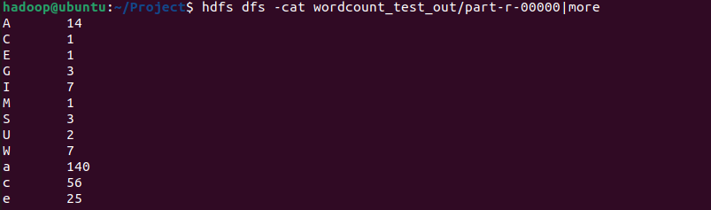
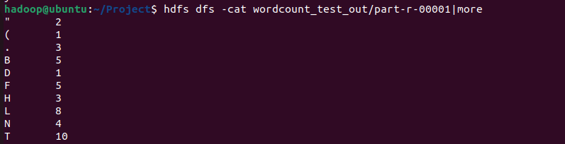
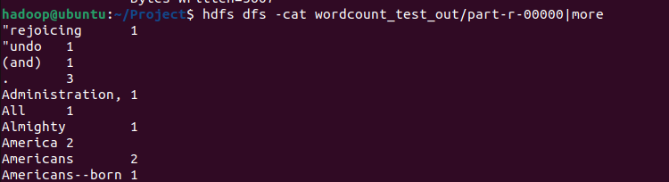
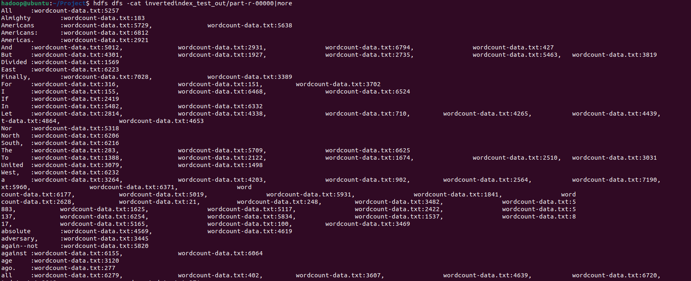
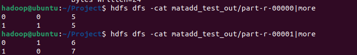
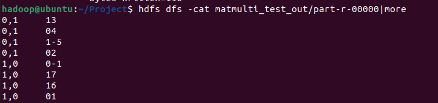

## Map Reduce Framework

- 맵리듀스의 출발.
  - 맵 리듀스는 구글 내부에서 크롤링된 문서, 로그 등 방대한 양의 raw data를 분석하는 과정에서 느낀 불편함에서 출발. 프로그램 로직 자체는 단순한데 입력 데이터의 크기가 워낙 방해서서 연산을 하나의 물리 머신에서 수행할 수가 없었고, 이 거대한 인풋 데이터를 쪼개 수많은 머신에 분산시켜서 로직을 수행한 다음 결과를 하나로 합치자는 것이 핵심 아이디어.

- 맵리듀스란?
  - 한 컴퓨터에서 수행할 작업을 여러 컴퓨터에 분산하여 처리하는 프로그래밍 모델
  - 연산을 수행할 작업을 여러 컴퓨터에 자동으로 작업을 분할, 작업을 위한 네트워크 통신을 수행하는데 사용.
  - 맵리듀스는 그리드 프로그램 (토렌트, 웹하드)등이 대표적
- MapReduce Framework 에서 개발자가 코드를 작성하는 부분은 크게 map() 함수 & reduce()함수라 생각하면 된다. 두 기능이 합쳐져 Map Reduce.
  - map() 함수는 분할한 데이터를 가공하는 Apply 기능을 수행하는 함수
    - 전체 데이터를 쪼갠 청크에 대해 실제로 수행할 로직. 
      - ex) 텍스트 데이터라면 텍스트를 파싱해서 단어의 개수를 세는 것. (wordcount)
    - map()는 in_key와 in_value를 입력받는 모습을 확인할 수 있다. in_key는 분할 단계의 결과로 얻은 Partitioning의 Key 값이다. 즉, 작업을 100개로 분할 했다면 0 ~ 99의 키 값을 갖는다.
  - reduce() 함수는 map() 한수로 가공한 데이터를 어떠한 기준에 따라 다시 하나로 병합하는 Combine 역할을 하는 함수
    - 여러 머신들에서 병렬적으로 수행된다.
    - reduce()의 입력 매개변수는 여러 map()의 intermediate_value들을 out_key 별로 구분한뒤 리스트 형태로 구성된 데이터를 입력으로 한다.. 위 리스트 데이터로, out_key 기준으로 총합 연산을 진행한다. 최종적으로 out_value의 list를 출력.

- MapReduce Process

  1. **쪼개기(Split):** 크기가 큰 인풋 파일을 작은 단위의 청크들로 나누어 분산 파일 시스템(ex. HDFS)에 저장.
  2. **데이터 처리하기(Map)**: 잘게 쪼개어진 파일을 인풋으로 받아서 데이터를 분석하는 로직을 수행.
  3. **처리된 데이터 합치기(Reduce)**: 처리된 데이터를 다시 합침.

- 실제 분산 처리 진행 나타내주는 다이어그램

  


- 환경셋팅

  - VMware 설치
    - https://www.vmware.com/products/workstation-player.html

  - VMware에 Ubuntu 설치 및 계정 생성

    - https://ubuntu.com/download/desktop

  - 터미널 실행 후 // 프로젝트 

    ```bash
    $ wget http://kdd.snu.ac.kr/~kddlab/Project.tar.gz
    
    $ tar zxf Project.tar.gz
    $ sudo chown -R hadoop:hadoop Project
    $ cd Project
    $ sudo mv hadoop-3.2.2 /usr/local/hadoop
    $ sudo apt update
    $ sudo apt install ssh openjdk-8-jdk ant -y
    $ ./set_hadoop_env.sh
    $ source ~/.bashrc
    
    // Empty 'ssh key' generation
    
    $ ssh-keygen -t rsa -P ""
    $ cat $HOME/.ssh/id_rsa.pub >> $HOME/.ssh/authorized_keys
    
    //제대로 생성되었는지 확인
    $ ssh localhost
    //질문 뜨면 yes 입력
    그 다음 비번 안물어보고 prompt 뜨면 성공
    
    //Path 지정 위해 /home/hadoop에서 source .bashrc 실행
    
    //Name node format
    $ hadoop namenode -format
    
    //Dfs daemon start
    $ start-dfs.sh
    
    // MapReduce daemon start(standalone 모드에서는 불필요)
    $ start-mapred.sh
    
    //확인
    $ jps
     - SecNameNode
     - ondaryNameNode
     - DataNode
     - TaskTracker(Standalone 모드에서는 불필요)
     - JobTracker(Standalone에서는 불필요)
    
    // 이 상태까지 완료 되면 hadoop 명령 수행 가능
    ```

- wordcount

- wordcountchar

  

  

- wordcountsort

  

  

- Inverted Index

  

- Matrix Addition

  

- Matrix Multiplication

  


- 왜 input key값이 LongWritable이 많고, value는 Text가 많을까?
  - key는 원래 input에 key값이 없다.
  - 갑싱 들어올때 하둡은 개행 단위로 끊어서 값을 받아온 후 순서대로 번호를 매김. 그리고 그 번호의 값이 key 가 됨. key값은 숫자가 되고 빅데이터 처리에서 데이터량이 많을 수 있을 것을 감안해, LongWritable.
  - 받는 값의 경우 Text로 해야 가공이 편해서 Text로 받는 경우가 많음.